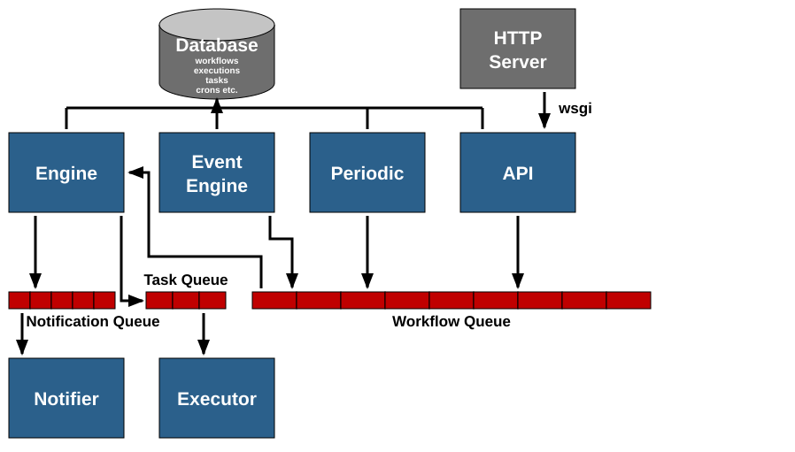

====================
Mistral Architecture
====================

Basic concepts
~~~~~~~~~~~~~~

A few basic concepts that one has to understand before going through the Mistral
architecture are given below:

* Workflow - consists of tasks (at least one) describing what exact steps should
  be made during workflow execution.
* Task - an activity executed within the workflow definition.
* Action - work done when an exact task is triggered.

Mistral components
~~~~~~~~~~~~~~~~~~

The Workflow service consists of the following components:

* ``Mistral API``
* ``Mistral Engine``
* ``Mistral Executor``
* ``Mistral Periodic`` (optional)
* ``Mistral Event Engine`` (optional)
* ``Mistral Notifier`` (optional)

Each component is described in more detail below.

The mistral project also provides the following python libraries:

``mistral-dashboard``
  Mistral Dashboard is a Horizon (OpenStack dashboard) plugin.

``python-mistralclient``
  Python client API and Command Line Interface.

``mistral-lib``
  A library used by mistral internals.

``mistral-extra``
  A collection of extra actions that can be installed to extend mistral
  standard actions with openstack ones (by default mistral does not ship
  any OpenStack-related actions).

To work correctly, mistral needs a database (usually ``mariadb`` or ``mysql``)
and a queue server (usually ``rabbitmq``).

The following diagram illustrates the architecture of mistral:

API server
----------

The API server exposes REST API to operate and monitor the workflow executions.

Engine
------

The engine picks up the workflows from the workflow queue. It handles the
control and dataflow of workflow executions. It also computes which tasks
are ready and places them in a task queue. It passes the data from task to
task, deals with condition transitions, etc.

The engine also embeds a scheduler that stores and executes delayed calls
(e.g. task retries, timeouts and other postponed operations). The scheduler
is not a standalone component: it runs inside the engine process and
persists its jobs in the database.

Executor
--------

The executor executes task Actions. It picks up the tasks from the queue,
run actions, and sends results back to the engine.

Periodic
--------

The periodic component processes cron triggers: when the next execution time
of a cron trigger is reached, it starts the corresponding workflow execution.
By default this processing loop still runs inside the API server, but this
behavior is deprecated: it can run as a dedicated server instead
(``mistral-server --server periodic``), which will become mandatory for cron
triggers in the next cycle. See
:ref:`running-cron-trigger-processing-separately` for how to deploy it.

Event Engine
------------

The event engine creates workflow executions based on external events: it
listens on configured exchanges (e.g. RabbitMQ, HTTP, Kafka) and, when a
matching event is consumed, starts the workflows associated with the
corresponding event triggers.
`This service is optional`.

Notifier
--------

On workflow and task execution, events are emitted at certain checkpoints such
as when a workflow execution is launched or when it is completed. The notifier
routes the events to configured publishers. The notifier can either be
configured to execute locally on the workflow engine or can be run as a server
much like the remote executor server and listens for events. Running the
notifier as a remote server ensures the workflow engine quickly unblocks and
resumes work. The event publishers are custom plugins which can write the
event to a webhook over HTTP, an entry in a log file, a message to Zaqar, and
etc.
`This service is optional`.
