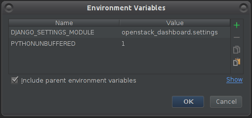

=====================
Debugging and Testing
=====================

To debug using a local engine and executor without dependencies such as
RabbitMQ, make sure your ``/etc/mistral/mistral.conf`` has the following
settings::

  [DEFAULT]
  rpc_backend = fake

  [pecan]
  auth_enable = False

and run the following command in *pdb*, *PyDev* or *PyCharm*::

  mistral/cmd/launch.py --server all --config-file /etc/mistral/mistral.conf --use-debugger

.. note::

    In PyCharm, you also need to enable the Gevent compatibility flag in
    Settings -> Build, Execution, Deployment -> Python Debugger -> Gevent
    compatible. Without this setting, PyCharm will not show variable values
    and become unstable during debugging.

Running unit tests in PyCharm
=============================

In order to be able to conveniently run unit tests, you need to:

1. Set unit tests as the default runner:

  Settings -> Tools -> Python Integrated Tools ->
  Default test runner: Unittests

2. Enable test detection for all classes:

  Run/Debug Configurations -> Defaults -> Python tests -> Unittests -> uncheck
  Inspect only subclasses of unittest.TestCase

Running examples
================

To run the examples find them in mistral-extra repository
(https://github.com/openstack/mistral-extra) and follow the instructions on
each example.

Automated Tests
===============

On Mistral project we have two separate test suites:

* Unit tests - executed by Jenkins CI job in OpenStack gerrit (python-style
  checks and execution of all unit tests)
* Integration tests - executed by Devstack Gate job in OpenStack Gerrit
  (integration tests for Mistral after the OpenStack deployment with devstack)

Where we can find automated tests
=================================

mistral:

* Unit tests can be found at
  https://github.com/openstack/mistral/tree/master/mistral/tests/unit
* Integration tests can be found at
  https://github.com/openstack/mistral-tempest-plugin/tree/master/mistral_tempest_tests/tests

python-mistralclient:

* Unit tests can be found at
  https://github.com/openstack/python-mistralclient/tree/master/mistralclient/tests/unit
* Integration tests can be found at
  https://github.com/openstack/python-mistralclient/tree/master/mistralclient/tests/functional

How to execute tests manually
=============================

Almost all existing automated tests can be executed manually on the
developer's desktop (except those which check OpenStack actions).
To do this, you should clone "mistral" repository (or "python-mistralclient")
and run the corresponding commands.

Cloning a repository:

.. code-block:: bash

    $ git clone https://git.opendev.org/openstack/mistral.git
    $ cd mistral

Unit tests
----------

To run all unit tests:

.. code-block:: bash

    $ tox

To run unit tests against a specific python version:

.. code-block:: bash

    $ tox -e py3

To run tests from a specific test class (using a specific python version):

.. code-block:: bash

    tox -e py3 -- 'DataFlowEngineTest'

Integration tests
-----------------

There are several suites of integration tests the mentioned repositories:

mistral-tempest-plugin:

* mistral_tempest_tests/tests/api/v2/test_workflows.py - contains the tests
  checking Mistral API v2 related to workflows
* mistral_tempest_tests/tests/api/v2/test_actions.py - contains the tests
  checking Mistral API v2 related to actions
* and so on

python-mistralclient:

* mistralclient/tests/functional/cli/v2/ - contains test suites which check
  interaction with Mistral using CLI

To run integration tests:

* in OpenStack mode (when auth in Mistral is enabled and Mistral integrates
  with OpenStack components)

.. code-block:: bash

    $ pip install git+http://git.opendev.org/openstack/tempest.git
    $ nosetests mistral-tempest-plugin/mistral_tempest_tests/tests/api/v2

* in Non-OpenStack mode:

  * set 'auth_enable=false' in the mistral.conf under [pecan] group
  * restart Mistral server
  * execute: ./run_functional_tests

Mistral-Dashboard debug instructions
====================================

**Pycharm**

Debugging OpenStack Mistral-Dashboard is the same as debugging OpenStack
Horizon.

The following instructions should get you sorted to debug both on the same run.

Set PyCharm debug settings:

1. Under File > Settings > Languages and Framework > Django -
Enter the following:

  a. Check "Enable Django Support"
  b. Django project root: your file system path to Horizon project root
  c. Settings: openstack_dashboard/settings.py (under your Horizon folder)
  d. Manage script: manage.py (also in your horizon folder)
  e. Click OK

.. image:: img/dashboard_django_settings.png

2. Enter debug configurations menu, using the tiny arrow pointing down,
   left to the "play" icon, or under the run menu

.. image:: img/Pycharm_run_config_menu.png

3. In the new window, click the green plus icon and then select "Django server"
   to create a new Django Server configuration.

4. In the new window appeared:

  a. Name that configuration Horizon
  b. Enter some port so it won't run on the default (for example - port: 4000)

.. image:: img/dashboard_debug_config.png

5. Click on Environment variables button, then in the new window:

  a. Make sure you have PYTHONUNBUFFERED set as 1
  b. Create a new pair - DJANGO_SETTINGS_MODULE : openstack_dashboard.settings
  c. When finished click OK.

You should now be able to debug and run the project using PyCharm.
PyCharm will listen to any changes you make
and restart the Horizon server automatically.

**Note**: When executing the project via PyCharm Run / Debug,
you could get an error page
after trying to login: "Page not found (404)".
To resolve that - remove the port from the browser URL bar,
then login.
You should be able to login without it.
After a successful login bring the port back - it will continue your session.

**Further notes**

- If you need help with PyCharm and general debugging, please refer to:
  `JetBrains PyCharm developer guide
  <https://www.jetbrains.com/pycharm/help/debugging.html>`_

- If you would like to manually restart the apache server,
  open a terminal and run::

    $ sudo service apache2 restart

  *(if not under Ubuntu, replace "sudo" with an identical command)*
