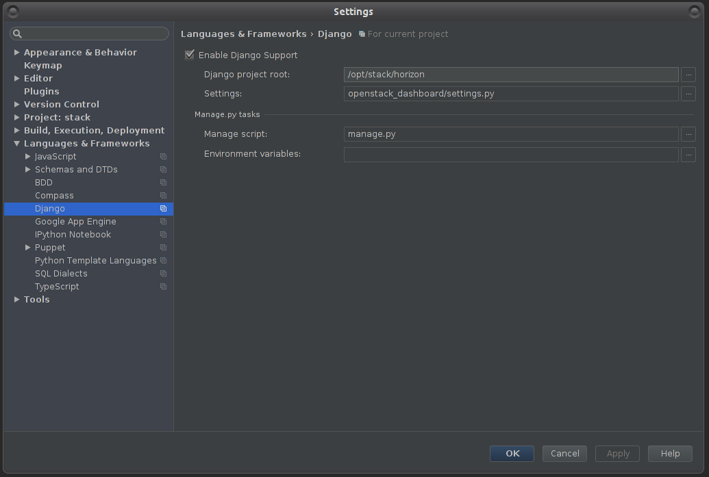
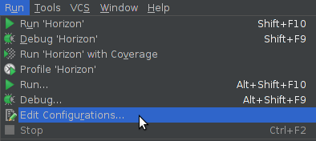

Troubleshooting And Debugging
=============================

Mistral-Dashboard Debug Instructions
------------------------------------

**Pycharm**

Debugging OpenStack Mistral-Dashboard is the same
as debugging OpenStack Horizon.
The following instructions should get you sorted to debug both on the same run.

Set PyCharm debug settings:

1. Under File > Settings > Languages and Framework > Django -  Enter the following:

  a. Check "Enable Django Support"
  b. Django project root: your file system path to Horizon project root
  c. Settings: openstack_dashboard/settings.py (under your Horizon folder)
  d. Manage script: manage.py (also in your horizon folder)
  e. Click OK

2. Enter debug configurations menu, using the tiny arrow pointing down,
   left to the "play" icon, or under the run menu

3. In the new window, click the green plus icon and then select "Django server"
   to create a new Django Server configuration.

4. In the new window appeared:

  a. Name that configuration Horizon
  b. Enter some port so it won't run on the default (for example - port: 4000)

.. image:: ../img/Mistral_dashboard_debug_config.png

5. Click on Environment variables button, then in the new window:

  a. Make sure you have PYTHONUNBUFFERED set as 1
  b. Create a new pair - DJANGO_SETTINGS_MODULE : openstack_dashboard.settings
  c. When finished click OK.

.. image:: ../img/Mistral_dashboard_environment_variables.png

You should now be able to debug and run the project using PyCharm.
PyCharm will listen to any changes you make
and restart the Horizon server automatically.

**Note**: When executing the project via PyCharm Run / Debug,
you could get an error page
after trying to login: "Page not found (404)".
To resolve that - remove the port from the browser URL bar,
then login.
You should be able to login without it.
After a successful login bring the port back - it will continue your session.

**Further notes**

- If you need help with PyCharm and general debugging, please refer to:
  `JetBrains PyCharm developer guide <http://www.jetbrains.com/pycharm/help/debugging.html.>`_

- If you would like to manually restart the apache server,
  open a terminal and run::

    sudo service apache2 restart

  *(if not under Ubuntu, replace "sudo" with an identical command)*
