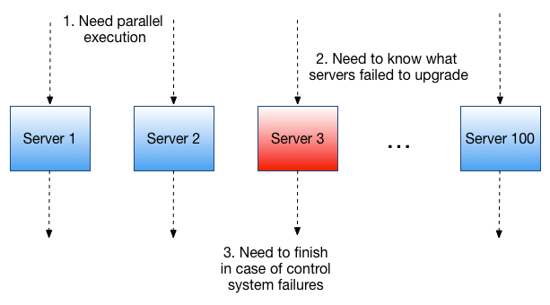
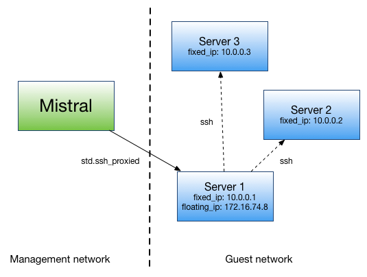

===========================================
Mistral for Administration (aka Cloud Cron)
===========================================

Prerequisites
=============

A reader should be familiar with basic Mistral concepts such as workflow,
task, action, cron trigger and YAQL expression language. Please refer to
the corresponding sections of :doc:`/user/index` to get more information
on that.

Background
==========

When it comes to managing IT infrastructure such as a cloud or a data
center, system administrators typically need to solve a lot of tasks.
To name just a few:

* Update Linux kernel or specific software on all or a subset of servers
* Re-configure certain software on a subset of servers
* Crawl data from a subset of servers and build a report based on this data
* Check health of certain software on a subset of servers or health of
  servers themselves

It’s worth adding that any of the tasks listed above may need to be done
periodically according to a specified schedule. Dealing with them would
require a lot of human attention if not using any special software that
would allow to automate it.

In this article we’ll take OpenStack cloud tenant as an example of IT
infrastructure that a system administrator needs to manage and see how
Mistral workflow service can be useful for addressing those cases and why
it’s worthwhile to use exactly workflow technology.

Important aspects
=================

So what does it take to solve any of the above problems? Let’s have a look
at pretty simple task as upgrading Linux kernel on a single server.
It requires the following:

* Download new linux kernel packages
* Install packages
* Reboot the server

Looks pretty simple to do. However, things get more complicated when:

* We want to do this for multiple servers
* We need to clearly see which servers have been successfully updated and
  which haven’t after this sequence is completed on all the servers
* We need to run this sequence automatically on a periodic basis

For example, if we want to do this kind of automation by just writing
a script (as administrators usually do), whether it is a Shell or Python,
we’ll quickly see that taking care of these aspects is pretty challenging
because in order to do that efficiently it makes sense to process all the
servers in parallel, and once all the servers have been processed send
a notification with the information showing whether all is fine or there
were issues occurred during some of the operations. Additionally, if a
script running on a single machine that is responsible for solving this
task just fails for whatever reason then the whole process of updating
a hundred servers will not complete and end up in an unknown state.

    Figure 1. Updating multiple tenant servers

So that shows that we need to take care of at least:

* Parallel execution
* Persistent state giving info about what happened with every server (at
  minimum, success or failure)
* High availability to make sure the whole thing will complete
* Notification mechanism so that we don’t have to check the status of the
  process manually

And, as a matter of fact, this should be repeated every time we need to do
something similar. Notification mechanism is not a must if we always want
to run this upgrade manually and it doesn’t take long. In case if a human
doesn't control when it starts and/or it takes long then notifications
become very important. That all actually means that we most likely need
to use an external tool that would take care of these concerns. A workflow
technology like Mistral workflow service is exactly the type of tool that
can help to deal with those problems.

Mistral-based solution
======================

Let’s now show how we can solve this kind of tasks with Mistral and explore
in details how Mistral addresses aforementioned concerns.

Updating Linux kernel on all tenant VMs
=======================================

As an example, let's see how we can upgrade Linux kernel version on all
cloud tenant servers (virtual machines, or just VMs) assuming they all have
Ubuntu installed on them. We'll also have some assumptions about how we
access guest operating systems which we'll mention separately. In fact,
those assumptions don't change much from overall approach perspective so
that it remains applicable if we alter some details as using a different
operating system, not Ubuntu.

This use case is fairly simple but it demonstrates the essential advantages
of using a workflow technology.

Initial workflow
================

The central Mistral concept is workflow so first of all, we need to create
a Mistral workflow that contains the logic of updating Linux kernel on
multiple tenant servers. Let’s create a text file named *update_kernel.yaml*
in any convenient text editor:

::

    ---
    version: '2.0'

    upgrade_kernel:
      input:
        - username: ubuntu
        - private_key_filename
        - gateway_host

      tasks:
        get_hosts:
          action: nova.servers_list
          publish:
            hosts: <% task(get_hosts).result.select({ip => $.addresses.get($.addresses.keys().first()).where($.get("OS-EXT-IPS:type") = fixed).first().addr}).ip %>
          keep-result: false
          on-success: upgrade

        upgrade:
          with-items: host in <% $.hosts %>
          action: std.ssh_proxied host=<% $.host %>
          input:
            host: <% $.host %>
            gateway_host: <% $.gateway_host %>
            username: <% $.username %>
            private_key_filename: <% $.private_key_filename %>
            cmd: "sudo apt-get update && sudo apt-get install linux-image-generic-lts-$(lsb_release -sc) -y && sudo reboot"

This is the simplest version of Mistral workflow that does what we need.
Let’s see what it consists of. It has two task definitions: “get_hosts”
and “upgrade”.

“get_hosts” calls Nova action “nova.servers_list” that returns information
about all servers in a tenant as JSON list. What we really need here is
to extract their IP addresses. In order to do that we declare “publish”
clause that introduces a new variable in workflow context called “hosts”
that will contain a list of IPs. YAQL expression used to extract IP
addresses is pretty tricky here just for how Nova structures networking
information.

NOTE: it’s easy to see in what form Nova returns info about a server
just by running:

.. code-block:: bash

    $ mistral run-action nova.servers_get '{"server": "<server-id>"}'

It’s worth noting that since in Mistral a result of a task is a result
of its action (or workflow) we use special task property “keep-result”
assigned with “false” so that the result doesn’t get stored in workflow
context. We do this just because we’re not interested in all information
that Nova returns, only IPs are relevant. This makes sense to do because
even if we have a tenant with 30 virtual servers all information about
them returned by Nova will take ~100 KB of disk space.

Task “upgrade” is where the most interesting things happen. It leverages
“with-items” functionality to iterate over a list of server IPs and ssh
to each of the servers in order to upgrade kernel. Word “iterate” here
doesn't mean though that processing is sequential. Conversely, here’s the
place where Mistral runs kernel upgrade in parallel. Every action execution
object for “std.ssh_proxied” is stored in database and keeps state and
result of upgrade operation on a certain virtual server.

An attentive reader may have noticed suffix "proxied" in name of action
"std.ssh_proxied" and asked "What does it mean? Why not just "std.ssh" which
Mistral also has in its standard action pack?" So now we're getting back
to the assumption about the way how we access guest operating system.
Mistral, by default, can't really get secure shell access to guest VMs
for how cloud isolates management network where all OpenStack services
reside from guest networks. In fact, if a server doesn't have a floating
IP then any service running in a management network can't get network
access to that server, it is simply in a different network. In our
particular example, we assume that at least one VM in a tenant has a
floating IP address so that it can be used as an ssh-gateway through which
we can actually ssh other VMs. That's why we're using special action called
"std.ssh_proxied" where "proxied" means that we have a proxy VM to access
all tenant VMs.

    Figure 2. Ssh access through a gateway VM.

Mistral is a distributed highly-available system and it’s designed not only
to survive infrastructural failures but also keep its workflows running.
That’s why we can make sure that such a process automated with a workflow
service as Mistral will finish even in case of failures of control system
components, which in our case Mistral engine and executors.

Adding notifications
====================

What our workflow is missing is the ability to notify a cloud operator when
kernel upgrade has complete on all servers. In order to do that we just need
to add one more task, let’s call it “send_success_email”. The full workflow
now would look like:

::

   ---
   version: '2.0'

   upgrade_kernel:
     input:
       - username: ubuntu
       - private_key_filename
       - gateway_host
       - email_info: null # [to_email, from_email, smtp_server, smtp_password]

     tasks:
       get_hosts:
         action: nova.servers_list
         publish:
           hosts: <% task(get_hosts).result.select({ip => $.addresses.get($.addresses.keys().first()).where($.get("OS-EXT-IPS:type") = fixed).first().addr}).ip %>
         keep-result: false
         on-success: upgrade

       upgrade:
         with-items: host in <% $.hosts %>
         action: std.ssh_proxied
         input:
           host: <% $.host %>
           gateway_host: <% $.gateway_host %>
           username: <% $.username %>
           private_key_filename: <% $.private_key_filename %>
           cmd: "sudo apt-get update && sudo apt-get install linux-image-generic-lts-$(lsb_release -sc) -y && sudo reboot"
         on-success:
           - send_success_email: <% $.email_info != null %>

       send_success_email:
         action: std.email
         input:
           subject: Linux kernel on tenant VMs successfully updated
           body: |
             Number of updated VMs: <% $.hosts.len() %>

           -- Thanks
           from_addr: <% $.email_info.from_email %>
           to_addrs: [<% $.email_info.to_email %>]
           smtp_server: <% $.email_info.smtp_server %>
           smtp_password: <% $.email_info.smtp_password %>

Note that along with task we’ve also added “on-success” clause for “upgrade”
task that defines a transition to task “send_success_email” on successful
completion of “upgrade”. This transition is conditional: it only works if
we passed data needed to send an email as an input parameter. That’s why
this new version of workflow has a new input parameter called “email_info”.
It’s expected that “email_info” is a data structure that consists of fields
“from_email”, “to_email”, “smtp_server” and “smtp_password”.

Uploading workflow to Mistral
=============================

Assuming we have installed Mistral client we can upload this workflow to
Mistral with the command:

.. code-block:: bash

    $ mistral workflow-create update_kernel.yaml

Normal output of this command (and most others) shows a table with a newly
uploaded workflow. It may look like:

.. code-block:: bash

 +----------------+--------+------------------------------+----------------------------+------------+
 | Name           | Tags   | Input                        | Created at                 | Updated at |
 +----------------+--------+------------------------------+----------------------------+------------+
 | upgrade_kernel | <none> | username=ubuntu, private_... | 2015-10-19 10:32:27        | None       |
 +----------------+--------+------------------------------+----------------------------+------------+

NOTE: In order to print all available workflows run:

.. code-block:: bash

    $ mistral workflow-list

Running the workflow
====================

Now once Mistral knows about workflow “upgrade_kernel” we can start it by
running:

.. code-block:: bash

    $ mistral execution-create upgrade_kernel input.json

File input.json should contain a workflow input data in JSON such as:

.. code-block:: rest

    {
        “private_key_filename”: “my_key.pem”,
        “gateway_host”: “172.16.74.8”
    }

Configuring a Cron Trigger
==========================

In order to make this workflow run periodically we need to create a cron
trigger:

.. code-block:: bash

    $ mistral cron-trigger-create update_kernel_weekly update_kernel --pattern “0 2 * * mon”

In order to print all active cron triggers run:

.. code-block:: bash

    $ mistral cron-trigger-list

From now on the workflow we created will be started every Monday at 2.00 am
and it will be updating Linux kernel on all servers in a tenant we logged in.

What’s important about Mistral Cron Triggers is that it is also a distributed
fault-tolerant mechanism. That means that if a number of Mistral engines crash
then cron triggers will keep working because there’s no single point of failure
for them.

If we no longer need to upgrade kernel periodically we can just delete the
trigger:

.. code-block:: bash

    $ mistral cron-trigger-delete update_kernel_weekly
