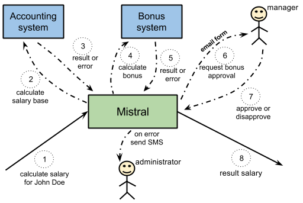

=============================
Long-running Business Process
=============================

Introduction
============

The use case described below is not the most important driver in the current
development process in Mistral. However, at later stages, when OpenStack
itself becomes more mature there will be a number of cloud users who would
want to build enterprise systems following the idea of this use case.

Problem Statement
=================

Looking back at the industry, say 20 years ago, it’s fairly obvious that
things have evolved drastically. For example, instead of having one
information system for everything like accounting, financial planning,
reporting enterprises tend to have multiple specialized systems in order
to address performance problems caused by constantly growing amount of
enterprise data. However, we may need to define a business process, or
a workflow, that would span several systems and for some calculation steps
may even require that people interact with the process by entering data
manually. Those people may be accountants entering primary information,
office managers, finance directors and others. The formal challenge here
is to define and maintain a sequence of operations that need to be executed
one after another and to be able to have some logic (conditions) driving the
execution of this sequence one way or another.

In order to make this workflow scalable (ability to run some steps in
parallel), tolerant to failures and observable for external systems
there has to be some component that would play the role of a coordinator.
By “observable for external systems” we mean here that we should be able
to see all the relevant information on how the process has been going on,
what steps have already been processed and what are left, whether it’s
stopped with a failure or finished with success. Maintaining a history of
already finished processes would also bring significant value.

Solution
========

Mistral is a perfect fit for being this kind of coordinator. In order to
illustrate everything described so far, let’s consider an imaginary workflow
of calculating employees’ salaries in an enterprise.

    Figure 1. Mistral maintains business workflows spanning multiple systems.

Given an employee full name (or id) such workflow may include the following
computation steps:

* Calculate salary base using accounting information system.
* Calculate the employee’s bonus using a different bonus system.
* Request an approval from a manager for calculated bonus.
* In case of any error at any stage send SMS to a system administrator

In this scenario Mistral always knows the execution state of the entire
workflow and in case of failures (network losses etc.) it can continue the
workflow from the point it stopped transparently for a user. Additionally,
Mistral can run calculation of salary base and bonus in parallel since
these two tasks are independent. All these things can be flexibly configured
by a user.

Notes
=====

The example above is just a simple illustration of what Mistral can offer
in regard to taking care of long-running business processes. In real life
Mistral can take care of much more complicated processes spanning multiple
information systems and involving real people at some points.
